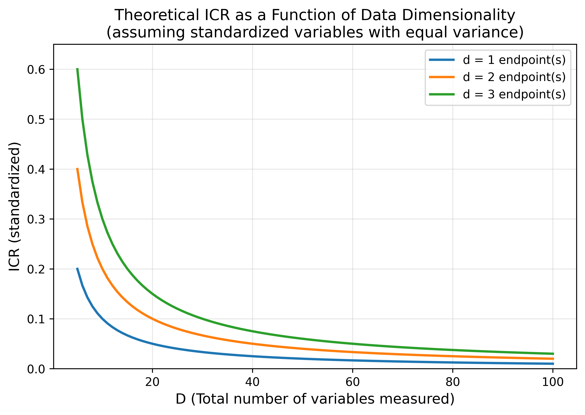
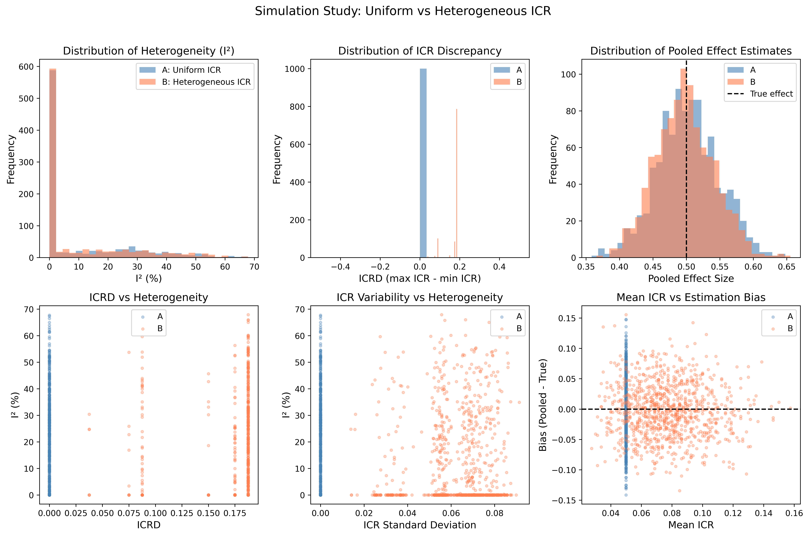
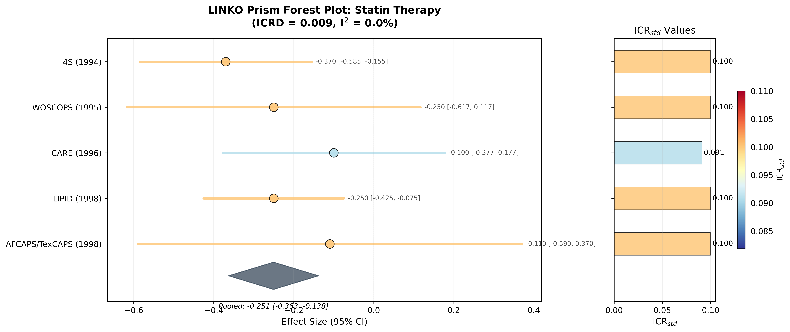
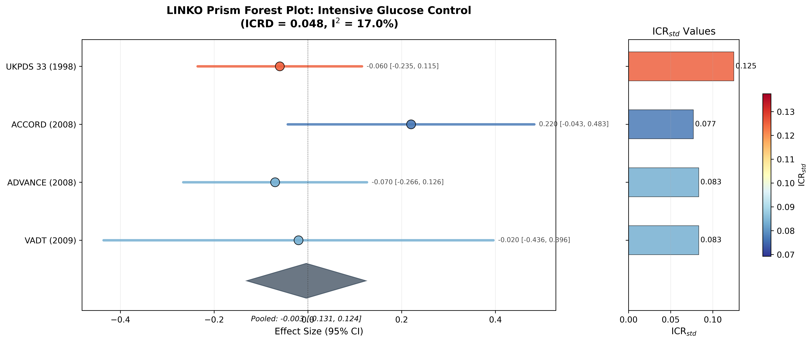
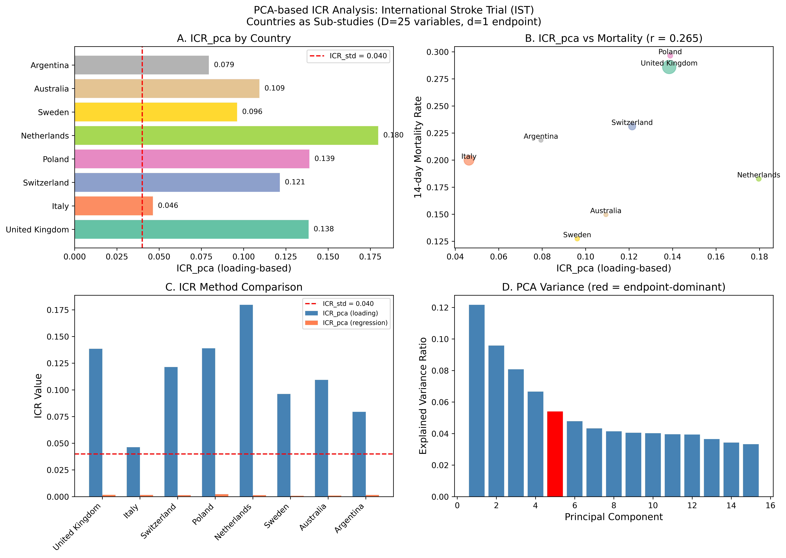
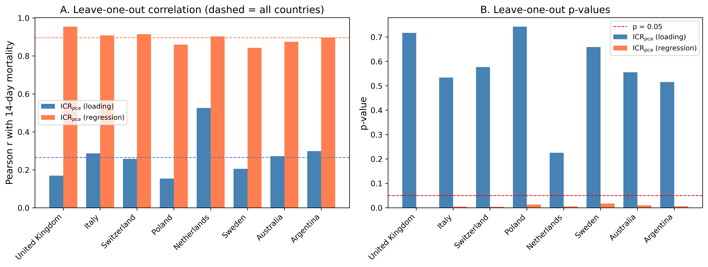
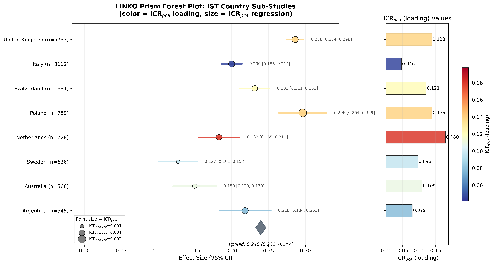

# The Information Contribution Ratio: a reproducible descriptor of endpoint informational weight in meta-analysis, and what it does and does not diagnose

Short title: Information Contribution Ratio in meta-analysis

Author: Tatsuki Onishi

Affiliation: [Affiliation]

Corresponding author: Tatsuki Onishi, [Address], [Email]

Word count of abstract: 229 (limit 250).

## Abstract

Meta-analysis pools one effect estimate per study, yet studies differ in how many variables they measure and in how the endpoint sits within that variable space. We formalise this structural feature as the Information Contribution Ratio (ICR), define its estimand, give estimators computable from published baseline tables and from individual participant data, and evaluate what the measure can and cannot support. In a Monte Carlo study with Monte Carlo standard errors, scenarios with heterogeneous ICR did not show a clearly higher I-squared than scenarios with uniform ICR (difference -0.41 percentage points, 95% Monte Carlo confidence interval [-1.91, 1.10]), and a negative-control scenario in which ICR varied without any structural mechanism produced comparable heterogeneity. Adding near-duplicate covariates changed the dimension-counting estimator to 0.50 times its original value while an eigenvalue-based effective-dimension version was essentially unchanged, showing that ICR is sensitive to variable counting conventions. In two published trial collections and in an exploratory analysis of eight country groups of the International Stroke Trial, ICR varied substantially across studies; the regression-based principal component estimator was associated with 14-day mortality (P = 0.003), but the groups are not independent trials and the analysis is hypothesis-generating. We conclude that ICR is best used as a reproducible descriptor of data structure and as a reporting adjunct, not as a validity criterion for pooling. All results are regenerated from public data by the accompanying code.

Keywords: meta-analysis; heterogeneity; evidence synthesis; principal component analysis; diagnostic plot; reproducibility

## 1 Introduction

Randomised controlled trials (RCTs) record many variables per participant, but meta-analysis reduces each trial to a single effect estimate for one endpoint. Between-study heterogeneity is routinely quantified with Cochran's Q, the I-squared index and the between-study variance tau-squared [1,2,3]. These quantities describe dispersion of effect estimates; they say nothing about the data structure from which each estimate was extracted.

A trial measuring ten baseline variables and a trial measuring eighty differ in an obvious way that is invisible to standard heterogeneity statistics. Whether this difference matters for pooling is an empirical question that, to our knowledge, has not been formalised. This paper does three things. First, it defines the Information Contribution Ratio (ICR), a descriptor of the share of a study's measured information carried by its endpoint, together with an explicit estimand and estimators for both published summary statistics and individual participant data (IPD). Second, it tests, rather than assumes, the hypothesis that dispersion in ICR across studies is associated with statistical heterogeneity, using a simulation study with negative controls and Monte Carlo standard errors [4]. Third, it examines the sensitivity of the measure to variable counting, coding and redundancy, which determines how it may legitimately be used.

We state the conclusion of these analyses in advance because it is negative in an important respect: in our simulations ICR dispersion by itself did not generate or predict heterogeneity, and the simplest ICR estimator is strongly dependent on how variables are counted. We therefore present ICR as a reproducible structural descriptor and a reporting adjunct, and we present the accompanying visualisation, the prism forest plot, as a display device rather than as a test.

Figure 1 shows the deterministic relationship between the number of measured variables and the simplest ICR estimator, which motivates both the appeal and the fragility of the measure.

*Figure 1. Relationship between the number of measured variables and the dimension-counting Information Contribution Ratio (ICR_std = d/D) for a single endpoint. The curve is deterministic and illustrates why the measure is dominated by variable counting.*

## 2 Methods

### 2.1 Estimand

Let a study measure D variables X_1,...,X_D on its participants, of which a subset E of size d constitutes the endpoint(s) used in the meta-analysis. Define the target quantity

    ICR = f(E; X_1,...,X_D),

the share of the study's measured information attributable to E under a specified information functional f and a specified variable set. The estimand is therefore conditional on (i) the variable set the investigators chose to measure and report, (ii) the coding of those variables, and (iii) the functional f. It is a property of the study's data structure, not of the underlying disease process or of the treatment effect. In the potential-outcomes sense it is not a causal estimand [5]; no counterfactual is involved. This restriction is deliberate and is the reason we do not interpret ICR as a validity criterion for pooling.

### 2.2 Estimators computable from published summary statistics

Two functionals are used. The dimension-counting estimator is

    ICR_std = d / D,

which is the share of the standardised variable space occupied by the endpoint when every variable is scaled to unit variance. The variance-ratio estimator is

    ICR_raw = sum_{j in E} Var(X_j) / sum_{j=1}^{D} Var(X_j),

computed on the reported measurement scales. For a continuous variable reported as mean and standard deviation by arm, the pooled within-study variance is reconstructed from the two arm variances and arm sizes; for a binary variable reported as a proportion p, the variance is p(1-p). ICR_raw is scale dependent by construction: a variable recorded in mg/dL contributes a far larger variance than the same variable in mmol/L, and a binary endpoint contributes a variance bounded by 0.25 while a laboratory variable may contribute several hundred. We report ICR_raw only to make this dependence explicit and we do not use it for comparison across studies.

Both estimators depend on the counting rules. We prespecified the following: each variable reported as a separate row of the baseline table counts once; a multi-level categorical variable with L levels counts as L-1 indicator variables; composite scores are counted once and their components are not counted separately if the components are not reported; variables reported only for a subgroup are excluded. The complete variable lists, their codings and their sources are given in the repository so that the counts can be audited and changed. Section 3.2 quantifies how much the estimator moves when redundant variables are added.

### 2.3 Estimators from individual participant data

When IPD are available, principal component analysis (PCA) on the correlation matrix of the standardised variables [6] gives two further estimators. The loading-based estimator sums the explained-variance ratios of components on which the endpoint has absolute loading at least 0.3:

    ICR_pca_loading = sum_{k in S_E} lambda_k / sum_k lambda_k.

The regression-based estimator performs PCA on the predictors only, regresses the endpoint on all component scores, and expresses the endpoint variance explained relative to the total information in the system:

    ICR_pca_reg = sum_k beta_k^2 lambda_k / (sum_k lambda_k + Var(Y)).

The loading threshold of 0.3 corresponds roughly to a squared loading of 0.1, i.e. a variable contributing at least about 10% of a component's variance; we report it explicitly and treat the loading-based estimator as the more fragile of the two.

### 2.4 Dispersion measures

Across the k studies of a meta-analysis we summarise dispersion of ICR by its range, ICRD = max_i ICR_i - min_i ICR_i, and by its coefficient of variation. Neither is a test statistic and neither has a reference distribution; they are descriptive.

### 2.5 Meta-analysis and sensitivity analyses

Effect estimates were pooled with random-effects models using three estimators of tau-squared: DerSimonian-Laird [3], restricted maximum likelihood and Paule-Mandel [7,8]. Confidence intervals were computed both with the Wald approach and with the Hartung-Knapp adjustment [9], and 95% prediction intervals were computed where k > 2 [10,11]. All estimators are implemented in the accompanying code and are reported side by side rather than selected post hoc.

### 2.6 Simulation study

The simulation follows the ADEMP structure [4]. Aims: to determine whether dispersion in ICR across studies is associated with, or causes, statistical heterogeneity, and to determine how sensitive the estimators are to variable counting. Data-generating mechanism: for each study, D correlated standard normal variables were generated per arm with an exchangeable-like correlation structure, n = 200 participants per study split equally between the two arms, a treatment effect of 0.5 standard deviations on the endpoint and a spillover fraction of 0.3 applied to non-endpoint variables. Estimands: the pooled endpoint effect and the heterogeneity statistics. Methods: DerSimonian-Laird random-effects meta-analysis of 10 studies. Performance measures: mean I-squared, mean tau-squared, bias of the pooled effect, and the paired difference in I-squared between scenarios, each with its Monte Carlo standard error over 1000 repetitions.

Scenario A held the number of variables fixed at D = 20 so that ICR was uniform. Scenario B drew D from {5, 10, 20, 40, 80} so that ICR varied. Scenario C added heterogeneous-ICR studies sequentially to a uniform-ICR base. The negative control repeated Scenario B with the spillover fraction set to zero, so that ICR varied while nothing in the data-generating mechanism could induce heterogeneity in the endpoint effect; under the hypothesis that ICR dispersion per se increases heterogeneity this scenario should behave like Scenario A.

The redundancy analysis added near-duplicate copies of existing covariates (a copy plus Gaussian noise) to a single simulated study, increasing D without adding information, and recorded ICR_std, ICR_raw and an eigenvalue-based alternative in which D is replaced by the participation ratio (sum of eigenvalues)^2 / sum of squared eigenvalues.

### 2.7 Published trial collections

Two collections were assembled from published reports: 5 statin trials [12,13,14,15,16] and 4 intensive glucose-control trials [17,18,19,20], with all-cause mortality as the endpoint. Baseline variables, effect estimates and their variances were entered into comma-separated files with a per-study citation and provenance note; the analysis reads those files. These collections illustrate the computation on real published structures. They are not systematic reviews, the trials were selected for illustration, and no inference about statin or glucose-control efficacy is intended.

### 2.8 Individual participant data example

The International Stroke Trial [21,22] provides open individual participant data for 19,435 patients. After restriction to complete cases on the 25 analysis variables, 18,451 patients remained; the 8 largest country groups (13,766 patients) were analysed as pseudo-studies. These groups are recruitment strata of a single trial with a common protocol and a common case-report form, not independent RCTs, so all IST results are exploratory and are reported without inferential claims. Because the case-report form is common, ICR_std is identical across groups by construction; only the PCA-based estimators vary. Sensitivity to individual groups was assessed by leave-one-out recomputation of the association between each estimator and 14-day mortality. Because larger groups give more stable covariance estimates, group size is a candidate common cause of both the estimators and the observed mortality; we therefore also report the partial correlation of each estimator with mortality given the logarithm of group size.

### 2.9 Prism forest plot

The prism forest plot is a standard forest plot in which marker colour encodes ICR and marker size encodes a second ICR variant when available, with a side panel listing the values. Its purpose is to make structural differences visible next to the effect estimates [23]; it performs no inference.

### 2.10 Software and reproducibility

Analyses were run in Python 3.10.12 with NumPy 2.2.6 and pandas 2.3.3. The IST data are downloaded by a script from the University of Edinburgh DataShare repository; the published-trial inputs are stored as comma-separated files with their sources. A single command regenerates every number, table and figure in this article into a results directory, and the manuscript is built by reading those files, so no value reported here is transcribed by hand.

## 3 Results

### 3.1 Simulation

Over 1000 repetitions, mean I-squared was 11.4% (Monte Carlo standard error 0.52) in the uniform-ICR scenario and 11.0% (Monte Carlo standard error 0.53) in the heterogeneous-ICR scenario. The paired difference was -0.41 percentage points with 95% Monte Carlo confidence interval [-1.91, 1.10]. The pooled effect was unbiased in both scenarios (bias +0.0020 and -0.0029). Across all repetitions of both scenarios the correlation between ICRD and I-squared was r = -0.008 (P = 0.707). In the negative control, where ICR varied but no structural mechanism operated, mean I-squared was 11.0% (Monte Carlo standard error 0.73), that is, of the same order as the two main scenarios. In the sequential scenario, adding heterogeneous-ICR studies changed I-squared by -2.86 percentage points on average (Monte Carlo standard error 0.59), with an increase in 26.3% of repetitions. Taken together, these results do not support the hypothesis that dispersion in ICR by itself produces detectable statistical heterogeneity in this data-generating mechanism (Table 1, Figure 2).

*Figure 2. Simulation results for the uniform-ICR (Scenario A) and heterogeneous-ICR (Scenario B) designs: distributions of I-squared, tau-squared, ICR discrepancy and the pooled effect.*

### 3.2 Sensitivity of the estimator to variable counting

Adding near-duplicate covariates to a single simulated study increased the counted dimension from 20 to 40 and reduced ICR_std from 0.0500 to 0.0250, that is to 0.50 times its original value, although the duplicated variables carried essentially no new information. ICR_raw behaved similarly. The eigenvalue-based alternative, which replaces the count D by the participation ratio, changed only from 0.0837 to 0.0848 (a ratio of 1.01; Table 2). The dimension-counting estimator is therefore an artefact of reporting practice as much as of study design, and comparisons of ICR_std across studies with different reporting conventions are not interpretable without an explicit counting protocol.

### 3.3 Published trial collections

In the statin collection, the number of reported baseline variables ranged from 10 to 11, giving ICR_std between 0.091 and 0.100 (ICRD 0.009, coefficient of variation 0.041). The pooled log risk ratio was -0.251 [-0.363, -0.138] with I-squared 0.0% (Table 3). In the glucose-control collection, ICR_std ranged from 0.077 to 0.125 (ICRD 0.048, coefficient of variation 0.240), the pooled log risk ratio was -0.003 [-0.131, 0.124] and I-squared was 17.0% (Table 4). The ordering of these two collections is consistent with the hypothesis, but with 5 and 4 studies respectively, two collections cannot distinguish a structural explanation from clinical and methodological differences; we report the comparison as an illustration and not as evidence. Within each collection, the association between ICR_std and effect size was r = -0.576 (P = 0.310) and r = -0.499 (P = 0.501).

ICR_raw ranged from 0.000005 to 0.001357 across the studies of the two collections, against ICR_std between 0.077 and 0.125 in the same studies, because the endpoints are binary while several baseline variables are laboratory measurements on wide scales (Table 3, Table 4). This confirms that ICR_raw is not comparable across studies that report different variable types or units, and it should not be used for pooling diagnostics.

Conclusions were unchanged under alternative between-study variance estimators, Hartung-Knapp intervals and prediction intervals (Table 5); the prediction intervals are, as expected, considerably wider than the confidence intervals.

Figure 3 shows the statin collection as a prism forest plot, in which ICR_std is visible alongside the effect estimates. The same display for the intensive glucose-control collection is given in Supplementary Figure S1.

*Figure 3. Prism forest plot for the statin collection. Marker colour encodes ICR_std; the side panel lists the values. The display is descriptive.*

*Supplementary Figure S1. Prism forest plot for the intensive glucose-control collection.*

### 3.4 Exploratory individual participant data analysis

Across the 8 IST country groups, the loading-based estimator ranged from 0.046 to 0.180 (coefficient of variation 0.36) and the regression-based estimator from 0.00073 to 0.00230 (coefficient of variation 0.33), while ICR_std was identical at 0.040 by construction (Table 6, Figure 4). The regression-based estimator was associated with 14-day mortality (r = 0.896, P = 0.003); the loading-based estimator was not (r = 0.265, P = 0.526). In leave-one-out recomputation the regression-based association ranged from r = 0.843 to 0.954 (P from < 0.001 to 0.017) and the loading-based association from r = 0.154 to 0.526 (Supplementary Table S1, Supplementary Figure S2).

The association is not explained by group size alone: the logarithm of the number of patients was correlated with mortality at r = 0.489 (P = 0.218) and with the regression-based estimator at r = 0.234 (P = 0.578), and the partial correlation of the regression-based estimator with mortality given log group size was r = 0.921 (P = 0.003, 5 degrees of freedom). With eight groups this adjustment has very little power and cannot exclude confounding by case mix or by other group-level features.

These groups share a protocol and a case-report form and differ in case mix, so an association between a covariance-structure summary and mortality is expected under several explanations that have nothing to do with meta-analytic pooling; with eight non-independent groups the association is hypothesis-generating only. We report it to show that the PCA estimators are computable and do vary meaningfully, not as validation of the framework.

*Figure 4. Principal-component-based ICR in eight International Stroke Trial country groups: estimator values, their dispersion, and their relation to 14-day mortality.*

*Supplementary Figure S2. Leave-one-out recomputation of the association between each PCA-based ICR estimator and 14-day mortality across the eight country groups.*

Figure 5 displays the same groups as a prism forest plot, with both PCA-based estimators encoded simultaneously.

*Figure 5. Prism forest plot for the International Stroke Trial country groups, with colour encoding the loading-based estimator and marker size the regression-based estimator. Rates are shown for display; the groups are not independent trials.*

### 3.5 Study ordering

Ordering studies by proximity to the median ICR did not reach a conclusive pooled estimate with fewer studies than random ordering: the mean number of studies required was 3.94 for random ordering, 3.91 for ICR-matched ordering and 4.00 for ICR-median ordering (Table 7). We report this negative result because ICR-guided prioritisation is an obvious application of the measure and, on this evidence, it is not supported.

## 4 Discussion

We defined the Information Contribution Ratio, gave estimators computable from published tables and from IPD, and tested the natural hypothesis that dispersion in this quantity is associated with statistical heterogeneity. The hypothesis was not supported in simulation, either against a uniform-ICR comparator or against a negative control, and an obvious application, ICR-guided study ordering, gave no advantage. At the same time the measure is easy to compute, varies substantially across real studies, and its PCA form varies across groups of a single trial that share a case-report form.

The practical implication is that ICR should be read as a structural descriptor, in the same family as reporting of the number and type of measured covariates, and not as a diagnostic of whether pooling is valid. Reporting it alongside I-squared and tau-squared costs nothing and makes explicit a feature of the included studies that is otherwise invisible; interpreting a large ICR discrepancy as evidence against pooling would not be justified by our results. Existing tools such as meta-regression [24] and funnel-plot diagnostics [25] remain the appropriate instruments for investigating heterogeneity and small-study effects.

Limitations. First, the dimension-counting estimator depends on how variables are counted, coded and aggregated, and our redundancy analysis shows the size of the problem: near-duplicate covariates alone changed it to 0.50 times its original value. Any application must fix a counting protocol in advance; the effective-dimension variant is a partial remedy but requires IPD. Second, ICR_raw is scale dependent and is close to zero whenever the endpoint is binary and covariates are measured on wide scales. Third, our data-generating mechanism induces structural differences through the number of measured variables and a spillover parameter; other mechanisms, for example endpoints that are composites of differing breadth, might behave differently, and our negative findings do not exclude them. Fourth, the published collections are illustrative and small, and the IST analysis uses country groups of one trial, which are not independent studies; these groups also differ in size, and although adjustment for log group size left the regression-based association essentially unchanged, eight groups cannot rule out group-level confounding by case mix. Fifth, we did not evaluate binary or time-to-event endpoints on IPD, where the notion of endpoint variance requires a different definition.

## 5 Conclusions

The Information Contribution Ratio is a reproducible descriptor of how much of a study's measured data is carried by its endpoint. It is computable from published baseline tables, it varies across real studies, and it can be displayed alongside effect estimates. On present evidence it is not a diagnostic of heterogeneity and not a criterion for deciding whether studies may be pooled, and its simplest form is sensitive to variable counting. We recommend that it be used, if at all, as a transparently defined reporting adjunct with a prespecified counting protocol.

## Acknowledgements

[To be completed]

## Conflict of interest

The author declares no conflict of interest.

## Funding

[To be completed]

## Data availability statement

The International Stroke Trial data are openly available from the University of Edinburgh DataShare repository at https://datashare.ed.ac.uk/handle/10283/124 and are downloaded by the script provided with the analysis code. The baseline and effect data extracted from the published statin and glucose-control trials, with their per-study citations, are included in the code repository. All analysis code, the generated results files and the manuscript build script are available at https://github.com/bougtoir/linko-icr-paper. Every number in this article is regenerated from those sources by a single command; the results files record the software versions and the commit used (commit c27eb0d6531e).

## Ethics

This study analysed simulated data and a publicly available, de-identified dataset; no ethical approval was required.

## References

1. Higgins JPT, Thompson SG, Deeks JJ, Altman DG. Measuring inconsistency in meta-analyses. *BMJ.* 2003;327:557-560.
2. Higgins JPT, Thomas J, Chandler J, et al. *Cochrane Handbook for Systematic Reviews of Interventions.* Version 6.4. Chichester: Wiley; 2023.
3. DerSimonian R, Laird N. Meta-analysis in clinical trials. *Control Clin Trials.* 1986;7:177-188.
4. Morris TP, White IR, Crowther MJ. Using simulation studies to evaluate statistical methods. *Stat Med.* 2019;38:2074-2102.
5. Rubin DB. Causal inference using potential outcomes. *J Am Stat Assoc.* 2005;100:322-331.
6. Jolliffe IT, Cadima J. Principal component analysis: a review and recent developments. *Philos Trans R Soc A.* 2016;374:20150202.
7. Veroniki AA, Jackson D, Viechtbauer W, et al. Methods to estimate the between-study variance and its uncertainty in meta-analysis. *Res Synth Methods.* 2016;7:55-79.
8. Paule RC, Mandel J. Consensus values and weighting factors. *J Res Natl Bur Stand.* 1982;87:377-385.
9. Hartung J, Knapp G. A refined method for the meta-analysis of controlled clinical trials with binary outcome. *Stat Med.* 2001;20:3875-3889.
10. IntHout J, Ioannidis JPA, Rovers MM, Goeman JJ. Plea for routinely presenting prediction intervals in meta-analysis. *BMJ Open.* 2016;6:e010247.
11. Riley RD, Higgins JPT, Deeks JJ. Interpretation of random effects meta-analyses. *BMJ.* 2011;342:d549.
12. Scandinavian Simvastatin Survival Study Group. Randomised trial of cholesterol lowering in 4444 patients with coronary heart disease (4S). *Lancet.* 1994;344:1383-1389.
13. Shepherd J, Cobbe SM, Ford I, et al. Prevention of coronary heart disease with pravastatin in men with hypercholesterolemia. *N Engl J Med.* 1995;333:1301-1307.
14. Sacks FM, Pfeffer MA, Moye LA, et al. The effect of pravastatin on coronary events after myocardial infarction in patients with average cholesterol levels. *N Engl J Med.* 1996;335:1001-1009.
15. The Long-Term Intervention with Pravastatin in Ischaemic Disease (LIPID) Study Group. Prevention of cardiovascular events and death with pravastatin in patients with coronary heart disease. *N Engl J Med.* 1998;339:1349-1357.
16. Downs JR, Clearfield M, Weis S, et al. Primary prevention of acute coronary events with lovastatin in men and women with average cholesterol levels (AFCAPS/TexCAPS). *JAMA.* 1998;279:1615-1622.
17. UK Prospective Diabetes Study (UKPDS) Group. Intensive blood-glucose control with sulphonylureas or insulin compared with conventional treatment (UKPDS 33). *Lancet.* 1998;352:837-853.
18. The Action to Control Cardiovascular Risk in Diabetes Study Group. Effects of intensive glucose lowering in type 2 diabetes. *N Engl J Med.* 2008;358:2545-2559.
19. The ADVANCE Collaborative Group. Intensive blood glucose control and vascular outcomes in patients with type 2 diabetes. *N Engl J Med.* 2008;358:2560-2572.
20. Duckworth W, Abraira C, Moritz T, et al. Glucose control and vascular complications in veterans with type 2 diabetes. *N Engl J Med.* 2009;360:129-139.
21. International Stroke Trial Collaborative Group. The International Stroke Trial (IST). *Lancet.* 1997;349:1569-1581.
22. Sandercock PAG, Niewada M, Czlonkowska A. The International Stroke Trial database. *Trials.* 2011;12:101.
23. Schild AHE, Voracek M. Less is less: a systematic review of graph use in meta-analyses. *Res Synth Methods.* 2013;4:209-219.
24. Thompson SG, Higgins JPT. How should meta-regression analyses be undertaken and interpreted? *Stat Med.* 2002;21:1559-1573.
25. Sterne JAC, Sutton AJ, Ioannidis JPA, et al. Recommendations for examining and interpreting funnel plot asymmetry. *BMJ.* 2011;343:d4002.

**Table 1.** Simulation results over 1000 repetitions, with Monte Carlo standard errors (MCSE). Scenario A: uniform ICR; Scenario B: heterogeneous ICR; negative control: heterogeneous ICR with no structural mechanism (500 repetitions).

| Performance measure | Scenario A | Scenario B | Negative control |
|---|---|---|---|
| Mean ICRD | 0.0000 (MCSE 0.0000) | 0.1740 (MCSE 0.0011) | 0.1709 (MCSE 0.0017) |
| Mean I-squared (%) | 11.44 (MCSE 0.52) | 11.04 (MCSE 0.53) | 11.01 (MCSE 0.73) |
| Mean tau-squared | 0.0039 (MCSE 0.0002) | 0.0038 (MCSE 0.0002) | 0.0037 (MCSE 0.0003) |
| Mean pooled effect | 0.5020 (MCSE 0.0015) | 0.4971 (MCSE 0.0014) | - |
| Bias | 0.0020 (MCSE 0.0015) | -0.0029 (MCSE 0.0014) | - |
| Difference in I-squared (B - A), 95% Monte Carlo CI | -0.41 [-1.91, 1.10] |  |  |

**Table 2.** Effect of adding near-duplicate covariates on the ICR estimators (500 repetitions; means across repetitions). The effective dimension is the participation ratio of the correlation-matrix eigenvalues.

| Redundant copies added | Counted variables D | ICR_std | ICR_raw | Effective dimension | ICR (effective dimension) |
|---|---|---|---|---|---|
| 0 | 20 | 0.0500 | 0.0529 | 11.97 | 0.0837 |
| 5 | 25 | 0.0400 | 0.0423 | 11.20 | 0.0895 |
| 10 | 30 | 0.0333 | 0.0353 | 11.26 | 0.0890 |
| 20 | 40 | 0.0250 | 0.0265 | 11.82 | 0.0848 |

**Table 3.** Statin trials: reported baseline variables, ICR estimators and all-cause mortality log risk ratios. Sources and provenance for every value are listed in the repository.

| Trial | Participants | D | d | ICR_std | ICR_raw | Log risk ratio |
|---|---|---|---|---|---|---|
| 4S (1994) | 4,444 | 10 | 1 | 0.100 | 1.72e-05 | -0.370 |
| WOSCOPS (1995) | 6,595 | 10 | 1 | 0.100 | 6.44e-06 | -0.250 |
| CARE (1996) | 4,159 | 11 | 1 | 0.091 | 2.13e-05 | -0.100 |
| LIPID (1998) | 9,014 | 10 | 1 | 0.100 | 2.68e-05 | -0.250 |
| AFCAPS/TexCAPS (1998) | 6,605 | 10 | 1 | 0.100 | 4.63e-06 | -0.110 |

**Table 4.** Intensive glucose-control trials: reported baseline variables, ICR estimators and all-cause mortality log risk ratios.

| Trial | Participants | D | d | ICR_std | ICR_raw | Log risk ratio |
|---|---|---|---|---|---|---|
| UKPDS 33 (1998) | 3,867 | 8 | 1 | 0.125 | 1.36e-03 | -0.060 |
| ACCORD (2008) | 10,251 | 13 | 1 | 0.077 | 1.03e-04 | +0.220 |
| ADVANCE (2008) | 11,140 | 12 | 1 | 0.083 | 7.00e-05 | -0.070 |
| VADT (2009) | 1,791 | 12 | 1 | 0.083 | 4.72e-06 | -0.020 |

**Table 5.** Sensitivity of the pooled estimate to the between-study variance estimator and to the interval method, statin collection (upper block) and glucose-control collection (lower block). PI: 95% prediction interval.

| tau-squared estimator | Interval | tau-squared | Pooled effect | 95% CI | 95% PI |
|---|---|---|---|---|---|
| DerSimonian-Laird | Wald | 0.0000 | -0.251 | [-0.363, -0.138] | [-0.433, -0.068] |
| DerSimonian-Laird | Hartung-Knapp | 0.0000 | -0.251 | [-0.380, -0.121] | [-0.399, -0.102] |
| REML | Wald | 0.0000 | -0.251 | [-0.363, -0.138] | [-0.433, -0.068] |
| REML | Hartung-Knapp | 0.0000 | -0.251 | [-0.380, -0.121] | [-0.399, -0.102] |
| Paule-Mandel | Wald | 0.0000 | -0.251 | [-0.363, -0.138] | [-0.433, -0.068] |
| Paule-Mandel | Hartung-Knapp | 0.0000 | -0.251 | [-0.380, -0.121] | [-0.399, -0.102] |
| Glucose control |  |  |  |  |  |
| DerSimonian-Laird | Wald | 0.0030 | -0.003 | [-0.131, 0.124] | [-0.368, 0.362] |
| DerSimonian-Laird | Hartung-Knapp | 0.0030 | -0.003 | [-0.211, 0.204] | [-0.369, 0.362] |
| REML | Wald | 0.0032 | -0.003 | [-0.131, 0.125] | [-0.374, 0.368] |
| REML | Hartung-Knapp | 0.0032 | -0.003 | [-0.211, 0.205] | [-0.374, 0.368] |
| Paule-Mandel | Wald | 0.0031 | -0.003 | [-0.131, 0.125] | [-0.372, 0.366] |
| Paule-Mandel | Hartung-Knapp | 0.0031 | -0.003 | [-0.211, 0.205] | [-0.372, 0.366] |

**Table 6.** International Stroke Trial country groups: sample size, 14-day mortality and ICR estimators. ICR_std is identical across groups because the case-report form is common.

| Country group | Patients | 14-day mortality | ICR_std | ICR_pca (loading) | ICR_pca (regression) | Endpoint components |
|---|---|---|---|---|---|---|
| United Kingdom | 5,787 | 28.6% | 0.040 | 0.138 | 0.00162 | 4 |
| Italy | 3,112 | 20.0% | 0.040 | 0.046 | 0.00153 | 2 |
| Switzerland | 1,631 | 23.1% | 0.040 | 0.121 | 0.00135 | 4 |
| Poland | 759 | 29.6% | 0.040 | 0.139 | 0.00230 | 4 |
| Netherlands | 728 | 18.3% | 0.040 | 0.180 | 0.00136 | 5 |
| Sweden | 636 | 12.7% | 0.040 | 0.096 | 0.00073 | 3 |
| Australia | 568 | 15.0% | 0.040 | 0.109 | 0.00096 | 4 |
| Argentina | 545 | 21.8% | 0.040 | 0.079 | 0.00157 | 3 |

**Supplementary Table S1.** Leave-one-out recomputation of the association between the PCA-based ICR estimators and 14-day mortality across the International Stroke Trial country groups.

| Excluded group | Groups analysed | r (loading) | P (loading) | r (regression) | P (regression) |
|---|---|---|---|---|---|
| United Kingdom | 7 | 0.169 | 0.717 | 0.954 | < 0.001 |
| Italy | 7 | 0.286 | 0.534 | 0.908 | 0.005 |
| Switzerland | 7 | 0.258 | 0.577 | 0.914 | 0.004 |
| Poland | 7 | 0.154 | 0.742 | 0.860 | 0.013 |
| Netherlands | 7 | 0.526 | 0.225 | 0.903 | 0.005 |
| Sweden | 7 | 0.205 | 0.659 | 0.843 | 0.017 |
| Australia | 7 | 0.272 | 0.555 | 0.875 | 0.010 |
| Argentina | 7 | 0.299 | 0.515 | 0.898 | 0.006 |
| None (all countries) | 8 | 0.265 | 0.526 | 0.896 | 0.003 |

**Table 7.** Number of studies required before the pooled estimate excluded the null, by ordering strategy (500 repetitions of 15 simulated studies).

| Ordering strategy | Mean studies to conclusive | Median | Conclusive by 5 studies | Conclusive by 10 studies | Mean studies to I-squared < 25% |
|---|---|---|---|---|---|
| Random order | 3.94 | 3.0 | 81.4% | 97.2% | 3.19 |
| ICR-matched first | 3.91 | 3.0 | 78.0% | 97.6% | 3.20 |
| ICR-median-ordered (LINKO) | 4.00 | 3.0 | 77.6% | 97.6% | 3.14 |
